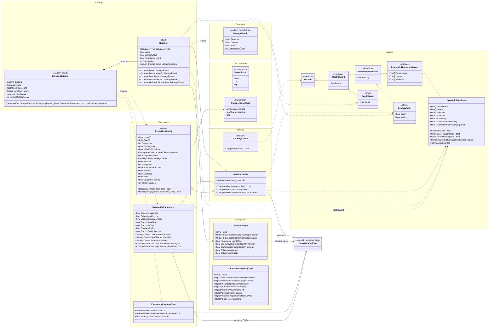

# Consequences — Class Diagram

```mermaid
classDiagram
    direction LR

    namespace Hazards {
        class IHazard {
            <<interface>>
        }
        class IDepthHazard {
            <<interface>>
            +float Depth
        }
        class IDepthVelocityHazard {
            <<interface>>
            +float Velocity
        }
        class IHydraulicTimeseriesHazard {
            <<interface>>
            +float[] TimeMinutes
            +float[] Depths
            +float[] Velocities
        }
        class DepthHazard {
            <<struct>>
            +float Depth
        }
        class DepthVelocity {
            <<struct>>
            +float Depth
            +float Velocity
        }
        class HydraulicTimeSeries {
            +float[] TimeMinutes
            +float[] Depths
            +float[] Velocities
            +float MaxDepth
            +float MaxVelocity
            +float MaxDepthTimesVelocity
            +float MaxDepthTimesVelocitySquared
            +GetDepth(float) float
            +GetMinutesToDepth(float) float
            +GetDurationMinutes(float) float
            +GetComputer() HydraulicTimeSeriesCompute
            +ToByteArray() byte[]
        }
    }

    namespace Stability {
        class IStabilityCriteria {
            <<interface>>
            +Collapsed(IHazard) bool
        }
        class StabilityCriteria {
            -OrderedPairedData _threshold
            +Collapsed(DepthVelocity, float) bool
            +Collapsed(float, float, float) bool
            +Collapsed(HydraulicTimeSeries, float) bool
        }
    }

    namespace Occupancy {
        class OccupancyType {
            +string Name
            +OrderedPairedData StructureDamageFunction
            +OrderedPairedData ContentDamageFunction
            +float FoundationHeightOffset
            +float StructureValuePercentageOfTheMean
            +float ContentValuePercentageOfTheMean
            +bool CollectivelyWarned
            +bool CollectivelyMobilize
        }
        class UncertainOccupancyType {
            +string? Name
            +object? UncertainStructureDamageFunction
            +object? UncertainContentDamageFunction
            +object? FoundationHeightUncertainty
            +object? StructureValueUncertainty
            +object? ContentValueUncertainty
            +object? EvacuatingGroupSize
            +object? FractionPopulationToRoofOrAttic
            +object? SubmergenceCriteria
        }
    }

    namespace Buildings {
        class Building {
            <<struct>>
            +OccupancyType OccupancyType
            +float Value
            +float ContentValue
            +float FoundationHeight
            +int NumStories
            +StabilityCriteria? SampledStabilityCriteria
            +Compute(float) DamageResult
            +Compute(DepthHazard) DamageResult
            +Compute(float, float) DamageResult
            +Compute(DepthVelocity) DamageResult
            +Compute(HydraulicTimeSeries) DamageResult
        }
        class LifeLossBuilding {
            <<readonly struct>>
            +Building Building
            +float AtticHeight
            +float OtherFloorHeight
            +float GroundFloorHeight
            +int AbleBodiedPeople
            +int LimitedMobilityPeople
            +GenerateEvacGroups(Random, EmergencyPlanningZone, EvacuationParameters, int, List~EvacuationGroup~)
        }
    }

    namespace Receptors {
        class DamageResult {
            <<readonly record struct>>
            +float Structure
            +float Content
            +float Total
            +int ComponentCount$
        }
    }

    namespace Evacuation {
        class EmergencyPlanningZone {
            +OrderedPairedData FirstAlertCdf
            +OrderedPairedData ProtectiveActionInitiationCdf
            +float WarningIssuanceOffsetMinutes
        }
        class EvacuationParameters {
            +bool CollectivelyWarned
            +bool CollectivelyMobilize
            +byte VehicleOccupancyRate
            +float FractionInVehicles
            +float FractionInCars
            +bool SimulateTraffic
            +float FractionTrafficReroute
            +StabilityCriteria LowClearanceStability
            +StabilityCriteria HighClearanceStability
            +StabilityCriteria PedestrianStability
            +OrderedPairedData LowClearanceRoadEntryCdf
            +OrderedPairedData HighClearanceRoadEntryCdf
        }
        class EvacuationGroup {
            <<struct>>
            +byte Under65
            +byte Over65
            +int OriginIndex
            +float WarningTime
            +float InitialMobilizeTime
            +TransportationMode ModeOfTransportation
            +float DepthThreshold
            +StabilityCriteria StabilityCriteria
            +bool HasGPS
            +int GroupIndex
            +float ActualMobilizeTime
            +bool Warned
            +bool Mobilized
            +bool Safe
            +bool CaughtEvacuating
            +int TotalPopulation
            +StabilityLost(float, float, float) bool
            +StabilityLost(HydraulicTimeSeries, float) bool
        }
    }

    namespace LifeLossEnums {
        class HazardLevel {
            <<enumeration>>
            None
            Low
            High
        }
        class TransportationMode {
            <<enumeration>>
            LowClearanceVehicle
            HighClearanceVehicle
            Foot
        }
    }

    class OrderedPairedData {
        <<external · Numerics.Data>>
    }

    %% Hazard inheritance
    IHazard <|-- IDepthHazard
    IDepthHazard <|-- IDepthVelocityHazard
    IDepthVelocityHazard <|-- IHydraulicTimeseriesHazard
    IDepthHazard <|.. DepthHazard
    IDepthVelocityHazard <|.. DepthVelocity
    IHydraulicTimeseriesHazard <|.. HydraulicTimeSeries

    %% Stability
    IStabilityCriteria ..> IHazard
    StabilityCriteria --> OrderedPairedData : threshold
    StabilityCriteria ..> DepthVelocity
    StabilityCriteria ..> HydraulicTimeSeries

    %% Occupancy
    OccupancyType --> OrderedPairedData : damage funcs

    %% Buildings
    Building --> OccupancyType
    Building --> StabilityCriteria
    Building ..> DamageResult : returns
    Building ..> DepthHazard
    Building ..> DepthVelocity
    Building ..> HydraulicTimeSeries
    LifeLossBuilding *-- Building : contains
    LifeLossBuilding ..> EvacuationGroup : creates
    LifeLossBuilding ..> EmergencyPlanningZone
    LifeLossBuilding ..> EvacuationParameters

    %% Evacuation
    EmergencyPlanningZone --> OrderedPairedData
    EvacuationParameters --> StabilityCriteria : 3
    EvacuationParameters --> OrderedPairedData : road-entry CDFs
    EvacuationGroup --> StabilityCriteria
    EvacuationGroup --> TransportationMode
    EvacuationGroup ..> HydraulicTimeSeries : StabilityLost
```
